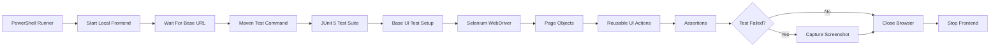
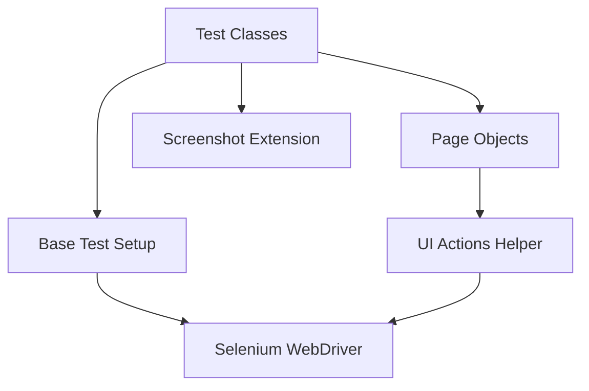
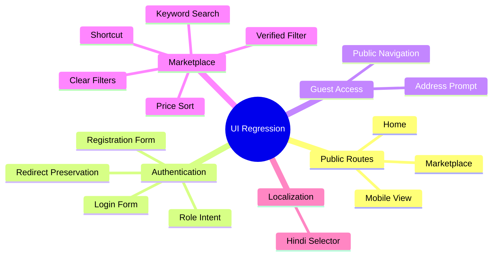

# Automation Architecture

This diagram shows how the local UI automation flow works without publishing private implementation code.

## Execution Flow

## Framework Layers

## Coverage Model

## Why This Matters

- The runner makes local execution possible without deployment.
- Page objects keep tests readable and easier to maintain.
- Shared UI actions reduce repeated Selenium code.
- Screenshot capture supports failure analysis.
- The public repository explains the framework without exposing private code.
