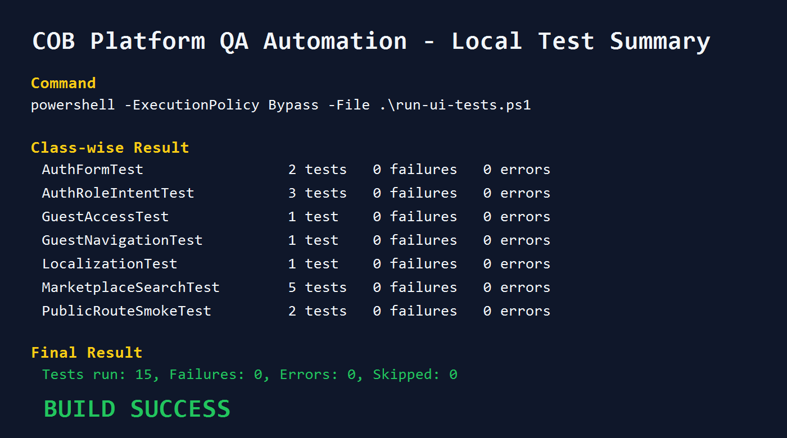
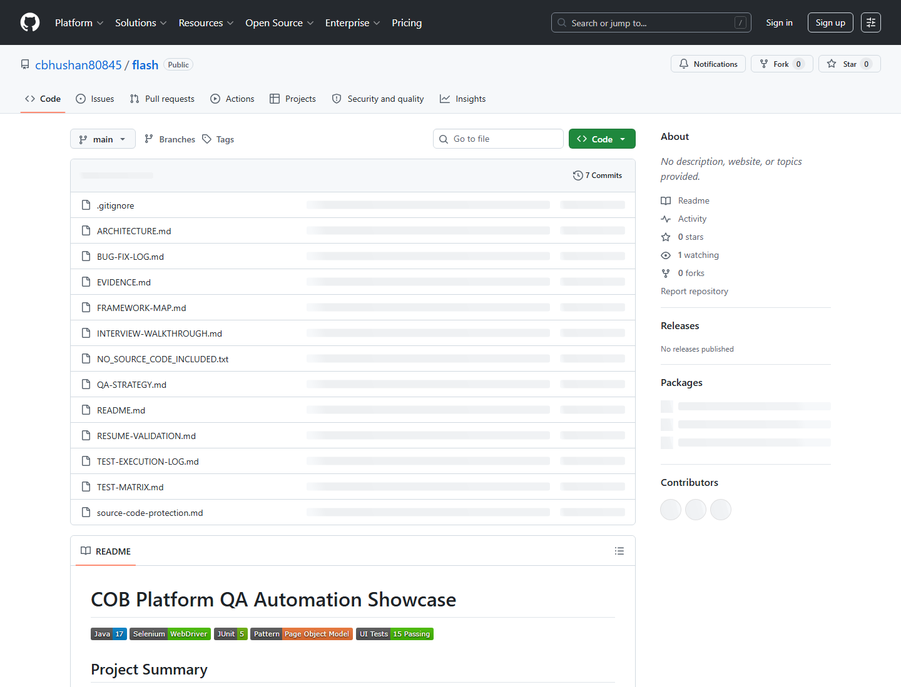

# COB Platform QA Automation Showcase

## Project Summary

COB Platform is a full-stack local services marketplace application with customer, labour, provider, and admin workflows. I built a professional QA automation layer around the project to validate public routes, authentication pages, guest access, localization, marketplace search, filters, and responsive rendering.

This showcase is designed for resume and LinkedIn sharing without exposing the private source code. It includes QA artifacts, execution summaries, and an interview walkthrough so the work reads like a focused case study.

## QA Automation Scope

- Created a Selenium WebDriver and JUnit 5 automation framework.
- Added Page Object Model structure for maintainable UI tests.
- Added reusable UI actions for clicking, typing, selecting values, checking page text, and waiting for dynamic content.
- Added automatic screenshot capture on failed UI tests.
- Added a PowerShell runner that starts the local frontend test server and executes the UI suite.
- Added structured QA documentation: test plan, test cases, and execution report.

## Automated Test Coverage

| Area | Coverage |
| --- | --- |
| Public routes | Home and marketplace smoke checks |
| Authentication | Login form, registration form, role intent, alternate auth links |
| Guest access | Address page login prompt and public navigation |
| Marketplace | Keyword search, service shortcut, verified filter, sort, clear filters |
| Localization | Hindi language selector check |
| Responsive UI | Home and marketplace mobile viewport checks |

## Latest Local Execution

| Suite | Result |
| --- | --- |
| Selenium UI automation | 15 tests passed, 0 failures, 0 errors |
| Backend Maven tests | Green |
| Frontend smoke checks | Green |

## Visual Summary

| Screenshot | Description |
| --- | --- |
|  | Fresh local UI automation run summary |
|  | Public showcase repository view |

Detailed project artifacts:

- [Execution Summary](EXECUTION-SUMMARY.md)
- [Test Execution Log](TEST-EXECUTION-LOG.md)
- [Automated Test Matrix](TEST-MATRIX.md)
- [QA Strategy](QA-STRATEGY.md)
- [Bug And Fix Log](BUG-FIX-LOG.md)
- [Framework Map](FRAMEWORK-MAP.md)
- [Automation Architecture](ARCHITECTURE.md)
- [Resume Notes](RESUME-NOTES.md)
- [Interview Walkthrough](INTERVIEW-WALKTHROUGH.md)
- [Source Code Protection Plan](source-code-protection.md)

## Tools And Technologies

- Java 17
- Selenium WebDriver
- JUnit 5
- Maven
- Page Object Model
- PowerShell test runner
- Next.js frontend
- Spring Boot backend
- PostgreSQL and H2 test profile

## Resume Bullet

Built a Selenium WebDriver and JUnit 5 QA automation framework for a full-stack services marketplace, covering smoke, authentication, guest access, localization, marketplace search/filter workflows, responsive checks, failure screenshots, and documented test execution with 15 passing automated UI tests.

## LinkedIn Summary

I recently built a QA automation framework for a full-stack services marketplace application. The framework uses Java, Selenium WebDriver, JUnit 5, Maven, Page Object Model, reusable UI actions, screenshot capture on failure, and a local test runner. Current automated coverage includes public route smoke tests, authentication forms, role-based registration intent, guest access, localization, marketplace search and filters, and responsive UI checks.

The source code is private, but the QA approach, coverage, and execution results are summarized here for portfolio review.

## Source Code Policy

The complete source code is kept private to protect project ownership. Recruiters or interviewers can request a guided walkthrough, recorded demo, or limited read-only access if needed.

## Suggested GitHub Profile Pin

Pin this repository with the title:

`COB Platform QA Automation Case Study`
